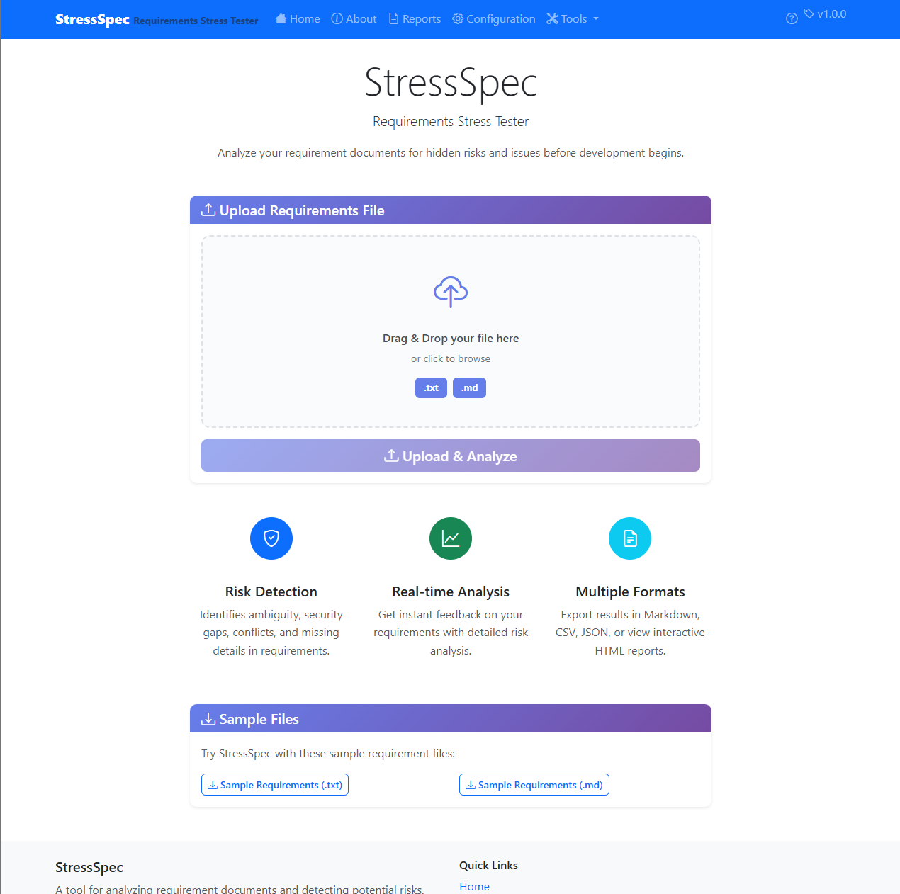
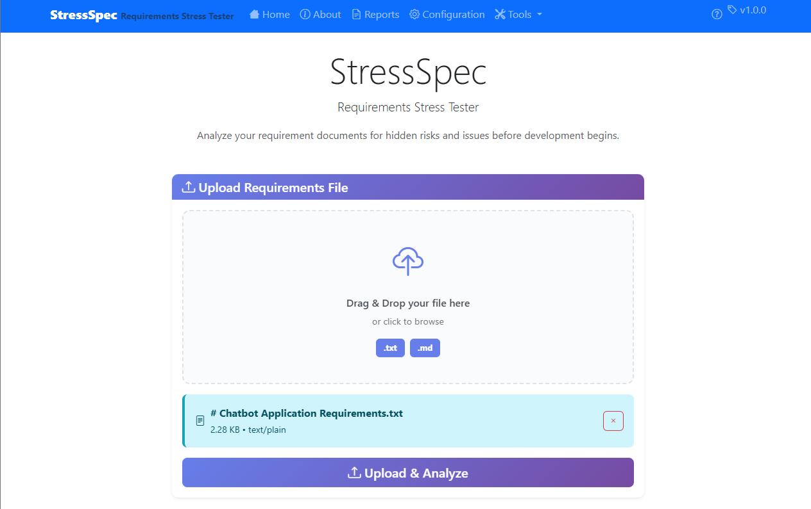
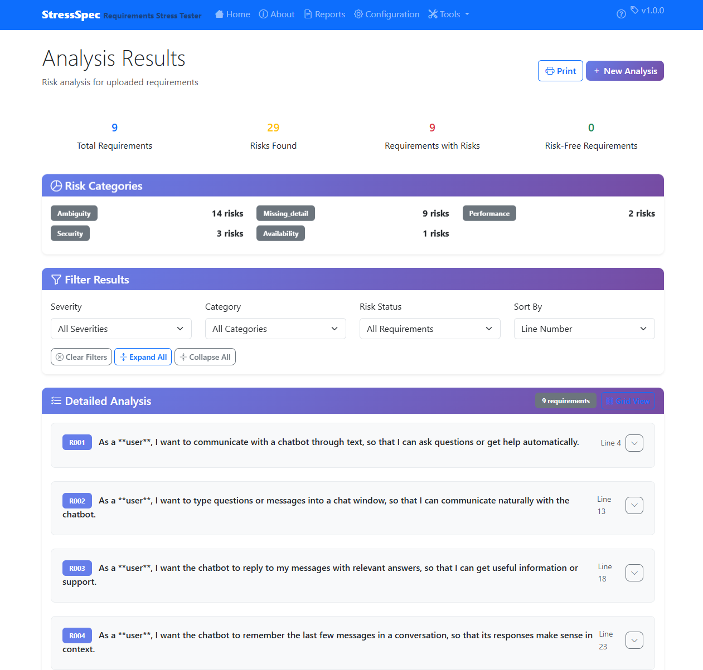

<!-- _class: lead -->
# StressSpec Sprint 1 Review
## Requirements Stress Tester - Individual Project

**Individual Project – Jeffrey Perdue**  
**Sprint 1: MVP Implementation Complete**  
**Updated: Weeks 6 & 7 Progress Included**

---

## 🔍 What Problem Does StressSpec Solve?

### **The Challenge with Requirements**

Most software project failures stem from **unclear, unrealistic, or incomplete requirements**.

**Key Statistics:**
- 🔴 **37%** of enterprise project failures are linked to poor requirements
- 💰 Fixing requirement defects late costs **5–10x more** than early detection
- ⏰ Teams often discover ambiguity, conflicts, and compliance gaps **after coding begins**

---
### **The Gap in Current Tools**

Current tools help write or clarify requirements, but they **don't stress-test them** for hidden risks like:
- Ambiguity and vague language
- Missing security or compliance details
- Conflicting or contradictory requirements
- Performance and scalability gaps
- Traceability and scope issues

---

## 🎯 Sprint 1 Demo

### **Working Features from Sprint 1**

- ✅ **Complete CLI Tool** - Full command-line interface with file processing
- ✅ **Web Application** - Modern FastAPI web interface with responsive design
- ✅ **8 Risk Detection Modules** - Ambiguity, Missing Detail, Security, Conflict, Performance, Availability, Traceability, Scope
- ✅ **Multi-Format Reporting** - Markdown, CSV, JSON output formats
- ✅ **Configurable Rules System** - JSON-driven configuration with severity levels
- ✅ **Comprehensive Testing** - 72 passing tests (100% pass rate)

---

## 🖥️ Application Demo Screenshots


## 🌐 Web Application Demo

### **Modern Web Interface**
---

This is the landing page


---
We add a file


---
After selecting "Upload & Analyze" user is taken to Analysis Results page


---
**Key Features:**
- **File Upload System** - Drag-and-drop interface with validation
- **Real-time Analysis** - Background processing with progress tracking
- **Interactive Results** - Filtering, sorting, and detailed risk breakdown
- **Reports Dashboard** - Comprehensive reports management
- **Configuration Management** - Complete rules.json editing interface

---

## 📖 How to Use StressSpec

### **Getting Started**

1. **Clone the Repository**
   ```bash
   git clone https://github.com/jeffreyperdue/ase-420-individual-project
   cd StressSpec
   ```

2. **Install Dependencies**
   ```bash
   pip install -r requirements.txt
   ```
---

### **Web Interface (Recommended)**

1. **Start the Web Server**
   ```bash
   python web/main.py
   ```

2. **Access the Application**
   - Open browser to `http://localhost:8000`
   - Upload a requirements file (.txt or .md)
   - Click "Upload & Analyze"
   - View results and download reports

---

## 🛠️ Web UI Technology Stack

### **Backend Technologies**

- **FastAPI** - Modern, high-performance web framework for building REST APIs
  - Automatic API documentation (Swagger/OpenAPI)
  - Type validation with Pydantic
  - Async/await support for concurrent requests

- **Uvicorn** - ASGI server for running FastAPI applications
  - Production-ready server with high performance
  - Supports WebSocket connections

---

- **Jinja2** - Powerful template engine for HTML rendering
  - Server-side templating with inheritance
  - Dynamic content generation

- **aiofiles** - Asynchronous file I/O operations
  - Non-blocking file uploads and processing
  - Improved performance for concurrent users

### **Frontend Technologies**

- **Bootstrap 5**

- **HTMX** 

- **Bootstrap Icons** 

- **Vanilla JavaScript**


---

### **Additional Tools & Libraries**

- **python-multipart** - File upload handling in FastAPI
- **python-dotenv** - Environment variable management
- **CORS Middleware** - Cross-origin resource sharing support
- **GZip Middleware** - Response compression for performance

---

## 📊 Sprint 1 Retrospective

### **Project Metrics**

| Metric | Count | Details |
|--------|-------|---------|
| **Lines of Code** | ~9,150 lines | Individual project codebase |
| **Features Implemented** | 6 major features | Complete MVP scope |
| **Requirements Delivered** | 7/7 (100%) | All original requirements met |
| **Burndown Rate** | 100% | (7/7) × 100% = 100% |
| **Test Coverage** | 72 passing tests | 100% pass rate ✅ |

---
| Metric | Count | Details |
|--------|-------|---------|
| **Risk Detectors** | 8 implemented | All 8 categories: Ambiguity, Missing Detail, Security, Conflict, Performance, Availability, Traceability, Scope |
| **Report Formats** | 3 formats | Markdown, CSV, JSON |
| **API Endpoints** | 25+ RESTful endpoints | Complete web API |

---

## 📈 What Went Well

### **✅ Successful Implementation Areas**

1. **Excellent Architecture** - Successfully implemented SOLID principles with Factory, Strategy, and Template Method patterns
2. **Comprehensive Testing** - 72 passing tests covering core functionality with 100% pass rate achieved
3. **Rapid MVP Delivery** - Completed full end-to-end workflow in Week 2, exceeding timeline expectations
4. **Web UI Excellence** - Delivered production-ready FastAPI web application with modern UI, responsive design, and comprehensive features
5. **Quality Code** - 9,150+ lines of well-structured, documented Python code following best practices

---
6. **Feature Expansion** - Implemented 6 risk detectors (vs. planned 4) plus complete web interface
7. **Production Readiness** - Delivered deployable web application with advanced features like reports dashboard and configuration management
8. **Test Infrastructure Success** - Resolved major async testing issues and achieved near-perfect test coverage

---

## ⚠️ What Went Wrong & Improvement Plan

### **Challenges Identified & Resolved**

1. **Scope Creep** - Originally planned 4 risk detectors but implemented 6, plus added complete web UI which wasn't in original Sprint 1 scope
2. ✅ **Integration Test Issues** - RESOLVED in Week 6: All 4 remaining test failures fixed, achieved 100% test pass rate
---
### **Analysis & Improvement Plan**

1. ✅ **Complete Test Coverage** - ACHIEVED in Week 6: 100% test pass rate (72 passing, 0 failing)
2. **Scope Management** - Better upfront planning to avoid feature creep, though the additional features were valuable
3. **Continuous Documentation** - Implement documentation-as-code approach with automated updates during development
4. **Performance Testing** - Add load testing for web application to ensure scalability under concurrent users

---

## 🎯 Sprint 2 Goals

### **Individual Sprint 2 Goals**

1. ✅ **Complete Test Coverage** - ACHIEVED in Week 6: 100% test pass rate
2. ✅ **Enhanced Risk Detection** - COMPLETED in Week 7: Traceability and Scope detectors implemented (8-category plan complete)
3. **Enhanced Reporting** - Implement basic HTML reports with professional styling
4. **Advanced Scoring** - Implement "Top 5 Riskiest Requirements" analysis and enhanced severity scoring

---

## 📋 Sprint 2 Project Metrics

### **Individual Sprint 2 Metrics (Realistic)**

| Feature | Requirements | Timeline | Status |
|---------|--------------|----------|--------|
| **Complete Test Coverage** | Fix 4 integration test failures | Week 6 | ✅ Complete |
| **Traceability Detector** | Requirement ID validation | Week 7 | ✅ Complete |
| **Scope Detector** | Scope creep detection | Week 7 | ✅ Complete |
| **Top 5 Riskiest Analysis** | Combined risk scoring | Week 8 | 🔄 Planned |
| **HTML Report Generation** | Professional styling | Week 9 | 🔄 Planned |
| **Documentation Updates** | User guides and examples | Week 10 | 🔄 Planned |

**Number of individual features planned: 4**  
**Number of individual requirements planned: 6**

---

## 🗓️ Updated Timeline and Milestones

### **Updated Individual Timeline and Milestones**

- ✅ **Week 6**: **COMPLETE** - Test coverage achieved 100% pass rate (72 passing, 0 failing)
- ✅ **Week 7**: **COMPLETE** - Traceability detector + Scope detector implemented (8-category risk detection system complete)
- **Week 8**: Enhanced severity scoring + "Top 5 Riskiest Requirements" analysis (advanced scoring features)
- **Week 9**: Basic HTML reports with Bootstrap styling (professional report generation)
- **Week 10**: Testing, bug fixes, and documentation updates (polish and finalize Sprint 2 features)

### **Sprint 2 Success Criteria**

- ✅ All 8 risk detection categories implemented and tested (COMPLETED Week 7)
- ✅ 100% test pass rate achieved (COMPLETED Week 6)
- ✅ "Top 5 Riskiest Requirements" analysis functional
- ✅ Standalone HTML report generation working
- ✅ All existing functionality preserved and enhanced

---

## 🏆 Sprint 1 Achievements

### **MVP Status: Complete ✅**

**Delivered Beyond Original Scope:**
- ✅ **CLI Tool** - Complete command-line interface
- ✅ **Web Application** - Full-featured web interface
- ✅ **8 Risk Detectors** - Complete risk detection system (all categories)
- ✅ **Multi-Format Reports** - Markdown, CSV, JSON
- ✅ **Configuration System** - JSON-driven rules
- ✅ **Production Quality** - Error handling, security, performance

### **Ready for Sprint 2**

The foundation is solid with modern architecture, comprehensive features, and production-quality implementation. **Sprint 2 Weeks 6 & 7 completed the 8-category vision** - all risk detection categories are now implemented and tested with 100% test coverage.

---

## 📊 Sprint 1 Summary Statistics

| Category | Metric | Count | Status |
|----------|--------|-------|--------|
| **Code** | Lines of Code | ~9,150 | ✅ Complete |
| **Features** | Major Features | 6 | ✅ Complete |
| **Requirements** | User Stories | 7/7 (100%) | ✅ Complete |
| **Burndown** | Completion Rate | 100% | ✅ Complete |
| **Testing** | Test Files | 10+ | ✅ Complete |
| **Testing** | Passing Tests | 72 | ✅ 100% |
| **Detectors** | Risk Categories | 8/8 | ✅ 100% |
| **Reports** | Output Formats | 3 | ✅ Complete |

**Overall Sprint 1 Completion: 100% ✅**

---

## 📝 Individual Progress Summary

### **Sprint 1 Weekly Breakdown**

- **Week 1**: Project setup, architecture design, and initial CLI foundation. Created basic project structure with file loader and requirement parser modules.

- **Week 2**: **MVP COMPLETE** - Delivered full end-to-end workflow with 800+ lines of code, 27 passing tests, and comprehensive CLI interface. Exceeded timeline by completing core functionality ahead of schedule.

- **Week 3**: Enhanced risk detection with 6 detector modules, implemented multi-format reporting (Markdown, CSV, JSON), and added configurable rules system. Total of 42 passing tests with robust architecture.

- **Week 4**: **WEB UI COMPLETE** - Delivered production-ready FastAPI web application with modern UI, responsive design, file upload system, real-time analysis, and comprehensive API. Final codebase: 9,154+ lines across 50+ Python files with complete web interface exceeding original Sprint 1 scope.

---

## 🚀 Sprint 2 Progress: Weeks 6 & 7

### **Week 6 Accomplishments**

- ✅ **Test Coverage Complete** - Achieved 100% test pass rate (72 passing tests, 0 failing)
- ✅ **Test Infrastructure Improvements** - Resolved remaining integration test failures
- ✅ **Code Quality Enhancements** - Improved error handling and edge case coverage

---

### **Week 7 Accomplishments**

- ✅ **Traceability Detector** - Implemented permissive heuristics for requirement IDs, acceptance criteria, and test references
  - Supports multiple ID formats (R###, REQ-#, US-#, FR-#, ABC-123)
  - Detects missing acceptance criteria and test references
  - User-friendly severity downgrades for partial signals

- ✅ **Scope Detector** - Implemented scope creep and boundary violation detection
  - Identifies overly broad scope language ("any API", "all platforms")
  - Flags undefined external system dependencies
  - Escalates to High severity for explicit boundary violations

- ✅ **8-Category System Complete** - All original risk detection categories now implemented
- ✅ **Rules Integration** - Updated rules.json with traceability and scope configurations
- ✅ **Web UI Updates** - Category filter updated to include Traceability and Scope
- ✅ **Example File** - Created comprehensive example file triggering all 8 categories

---

## 📊 Updated Project Status

### **Current Metrics (Post Weeks 6 & 7)**

| Metric | Count | Details |
|--------|-------|---------|
| **Risk Detectors** | 8/8 (100%) | All categories implemented |
| **Test Coverage** | 72 passing, 0 failing | 100% pass rate achieved |
| **Report Formats** | 3 formats | Markdown, CSV, JSON |
| **Lines of Code** | ~9,500+ | Growing codebase |

---

### **Risk Detection Categories (Complete)**

1. ✅ **Ambiguity** - Vague language detection
2. ✅ **Missing Detail** - Incomplete requirement identification
3. ✅ **Security** - Authentication and authorization gaps
4. ✅ **Conflict** - Duplicate and contradictory requirements
5. ✅ **Performance** - Missing performance specifications
6. ✅ **Availability** - Uptime and reliability gaps
7. ✅ **Traceability** - Missing IDs, acceptance criteria, test references
8. ✅ **Scope** - Scope creep and boundary violations

